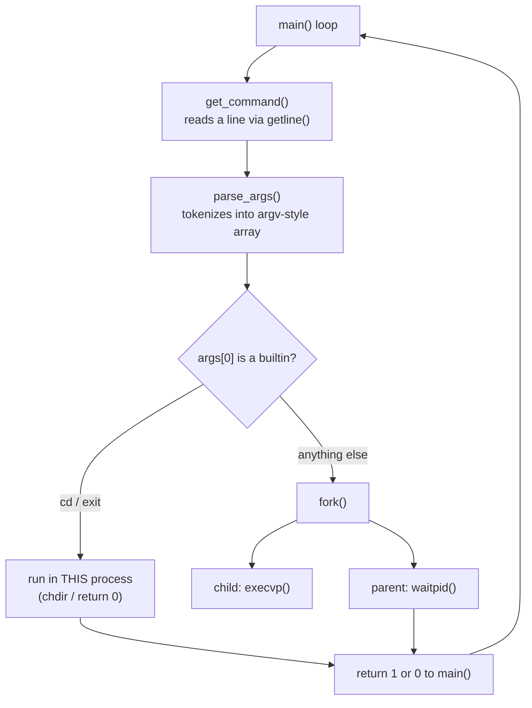

# 🐚 mini-shell

> A Unix-style command shell built from scratch in C — project #5 in my journey through low-level systems programming and (eventually) exploit development.

**Author:** Kwame Appiah Kumi-Appiah
📧 [kwameappiahkumi@gmail.com](mailto:kwameappiahkumi@gmail.com)
💼 [LinkedIn](https://www.linkedin.com/in/kwameappiah-kumi-appiah/)
💻 [GitHub](https://github.com/kwamekumiappiah)

---

## Table of Contents

- [Why I built this](#why-i-built-this)
- [What it does](#what-it-does)
- [Architecture](#architecture)
- [Project structure](#project-structure)
- [Building & running](#building--running)
- [What I learned](#what-i-learned)
  - [1. The process lifecycle: fork, exec, wait](#1-the-process-lifecycle-fork-exec-wait)
  - [2. Builtins vs. external commands](#2-builtins-vs-external-commands)
  - [3. Manual memory & buffer management](#3-manual-memory--buffer-management)
  - [4. Designing return-value contracts instead of scattering `exit()`](#4-designing-return-value-contracts-instead-of-scattering-exit)
  - [5. Defensive programming against null/garbage input](#5-defensive-programming-against-nullgarbage-input)
- [Why a shell, specifically (the exploitation angle)](#why-a-shell-specifically-the-exploitation-angle)
- [Bugs I hit and fixed](#bugs-i-hit-and-fixed)
- [Known limitations](#known-limitations)
- [Roadmap](#roadmap)
- [Resources that helped](#resources-that-helped)
- [Contact](#contact)

---

## Why I built this

This is my 5th project in learning C, and the first one that forced me to actually think about **processes**, not just functions and memory. Shells sit at a perfect intersection for someone learning low-level systems + security fundamentals: to build one you have to understand `fork()`/`exec()`/`wait()`, process images, file descriptors, and argument-vector construction — all things that come up again later when reading about exploitation, process injection, and how `/bin/sh` gets spawned in the first place.

The goal wasn't to build something feature-complete. It was to build something *correct*, understand every line of it, and document the mental model as I went.

## What it does

A REPL that:
- Prints a prompt and reads a line of input (`getline`)
- Tokenizes it into an argument vector
- Runs it as either:
  - a **builtin** (`cd`, `exit`) — handled directly in the shell's own process, no fork
  - an **external program** — forked, `execvp`'d, and waited on
- Loops until EOF (Ctrl+D) or `exit`

```
myshell> echo hello world
hello world
myshell> cd /tmp
myshell> pwd
/tmp
myshell> exit
```

## Architecture



The key design decision: **builtins never fork.** `cd` has to run in the shell's own process, because `chdir()` in a forked child would only change *the child's* working directory — the parent (your actual shell) would be completely unaffected. This was the first "aha" moment of the project: a shell isn't just a program that runs other programs, it's a program that sometimes *is* the command.

## Project structure

```
.
├── main.c          # the REPL: prompt, read, parse, execute, loop
├── mini_shell.c     # implementation: builtins, parsing, fork/exec logic
├── mini_shell.h      # public interface shared between main.c and mini_shell.c
└── README.md
```

## Building & running

```bash
gcc -Wall -Wextra -std=c11 -g -o myshell main.c mini_shell.c
./myshell
```

I compile with `-Wall -Wextra` on purpose — most of the bugs below were caught by warnings before they ever became runtime crashes.

## What I learned

### 1. The process lifecycle: fork, exec, wait

Before this project, "a program runs" was a black box to me. Now I can trace it:

- `fork()` clones the *entire* current process — same memory (via copy-on-write), same open file descriptors, same everything — and returns twice: once in the parent (with the child's PID) and once in the child (with `0`).
- `execvp()` doesn't create a new process — it **replaces** the current process image with a new program. It only returns if it *failed*. That "it only returns on failure" behavior tripped me up at first; I kept writing code expecting a return value on success.
- `waitpid()` blocks the parent until the specified child changes state (exits, in our case), and is what stops the shell from printing the next prompt before a command has actually finished.

The pattern `fork() → if child: execvp() → if parent: waitpid()` is now burned into memory, and I understand *why* each piece is necessary instead of just copy-pasting it.

### 2. Builtins vs. external commands

Learned that not every "command" a shell runs is a separate program. `cd` and `exit` have to be **intercepted before `fork()`** and handled by mutating the shell's own state — this is the difference between a command that changes *the shell's* environment vs. one that just produces output. It's a small distinction that explains a lot about how real shells (bash, zsh) are structured internally.

### 3. Manual memory & buffer management

- `getline()` was my first real exposure to a function that manages its own heap allocation for you (`realloc`-ing the buffer as needed) — a nice middle ground between "I manage everything" (`malloc`/`free` by hand) and "the language manages everything" (higher-level languages I'd used before).
- `strtok()` mutates the string it's given in place, inserting `'\0'` after each token instead of copying anything — which is why `parse_args()` doesn't allocate any new memory for the tokens; `args[i]` just points into the middle of the original line buffer. Understanding *why* that buffer has to stay alive as long as `args` is being used was an important lesson in pointer lifetimes.
- Traced through exactly where `free(line)` needs to happen so it runs on **every** exit path (EOF, parse error, normal `exit`) instead of leaking on early returns.

### 4. Designing return-value contracts instead of scattering `exit()`

My first draft had `shell_exit()` calling libc's `exit()` directly from deep inside the call stack. It worked, but it meant the program's shutdown logic lived in two places at once (`main()`'s loop condition, *and* a random `exit()` call three functions away) — a real code smell that a code review helped me spot.

Refactored so `shell_execute()` returns `1` (keep running) or `0` (stop), and `main()`'s `while(running)` loop is the **single source of truth** for the program's lifetime. This taught me a general principle I hadn't put into words before: prefer values that flow back up the call stack over side-effecting control-flow that reaches down into shared state from anywhere.

### 5. Defensive programming against null/garbage input

Learned to think adversarially about my own input handling, even before any "exploitation" framing:
- What if the user hits Enter with no input? (`args[0]` is `NULL` — check before dereferencing)
- What if `cd` gets no argument? (`args[1]` could be `NULL` — check before passing to `chdir()`)
- What if `fork()` itself fails (resource exhaustion)? (`pid < 0` — don't assume it always succeeds)
- Zero-initializing `char *args[MAX_ARGS] = {0}` so that a partial/aborted parse never leaves `execvp()` reading uninitialized stack garbage as a pointer.

## Why a shell, specifically (the exploitation angle)

Part of why I picked this project is that shells show up constantly once you start reading about security and exploitation — `/bin/sh` is the canonical "what an attacker wants to spawn" target in classic stack-smashing writeups, and `system()`/`execve()`-style calls are exactly the primitives this project forced me to actually understand at the C level rather than treat as magic. Building my own version — however small — of the thing that `execve("/bin/sh", ...)` hands control to made concepts like "argument vectors," "process images," and "what actually happens when a program starts" concrete instead of abstract.

This project doesn't touch memory-safety vulnerabilities on purpose (no raw buffers copied without bounds, no format-string sinks) — but understanding fork/exec/argv mechanics *cleanly* first is exactly the foundation I want in place before I start deliberately studying how that mechanism gets abused.

## Bugs I hit and fixed

A few things a code review caught that I want to remember for next time:

| Bug | Why it mattered |
|---|---|
| `shell_execute()`'s return value was computed but never checked in `main()` | All the "keep shell running" return-code logic was dead code — the loop only worked because of `while(1)` and a stray `exit()` elsewhere |
| `shell_exit()` called `exit()` directly | Bypassed `main()`'s loop entirely; shutdown logic lived in two disconnected places |
| `const int` as a return type | Meaningless for a function returning a value by copy (not a pointer) — a leftover misunderstanding from pointer-`const` rules |
| `free(line)` was unreachable on the EOF path | Early `return` in `main()` skipped cleanup at the bottom of the function |
| Parse-error branch printed a message but still called `shell_execute()` anyway | Missing `continue`/`break` after the error print |

## Known limitations

- No pipes (`\|`), redirection (`>`, `<`), or background jobs (`&`) yet
- No signal handling (Ctrl+C currently kills the whole shell, not just a running child)
- No quoting/escaping support in the tokenizer (`echo "hello world"` is parsed as two args, not one)
- Fixed-size argument array (`MAX_ARGS`) rather than dynamic growth

## Roadmap

- [ ] I/O redirection (`>`, `>>`, `<`)
- [ ] Pipes between commands (`cmd1 | cmd2`)
- [ ] Signal handling (`SIGINT` shouldn't kill the shell itself)
- [ ] Background execution with `&` and basic job control
- [ ] Quoted-string and escape-character support in the tokenizer
- [ ] History (up-arrow recall)

## Resources that helped

- `man` pages for `fork`, `execvp`, `waitpid`, `getline`, `strtok` — read before writing a single line
- *Operating Systems: Three Easy Pieces* (OSTEP), the process API chapters
- Various "build your own shell" writeups, used only after attempting each piece unassisted first

## Contact

I'm documenting this learning journey publicly as I go — feel free to reach out if you spot something wrong, have feedback, or just want to talk low-level C / security fundamentals.

- 📧 **Email:** [kwameappiahkumi@gmail.com](mailto:kwameappiahkumi@gmail.com)
- 💼 **LinkedIn:** [linkedin.com/in/kwameappiah-kumi-appiah](https://www.linkedin.com/in/kwameappiah-kumi-appiah/)
- 💻 **GitHub:** [github.com/kwamekumiappiah](https://github.com/kwamekumiappiah)

---

*⭐ If you're also learning low-level C, feel free to fork this, break it, and see what you learn from putting it back together.*